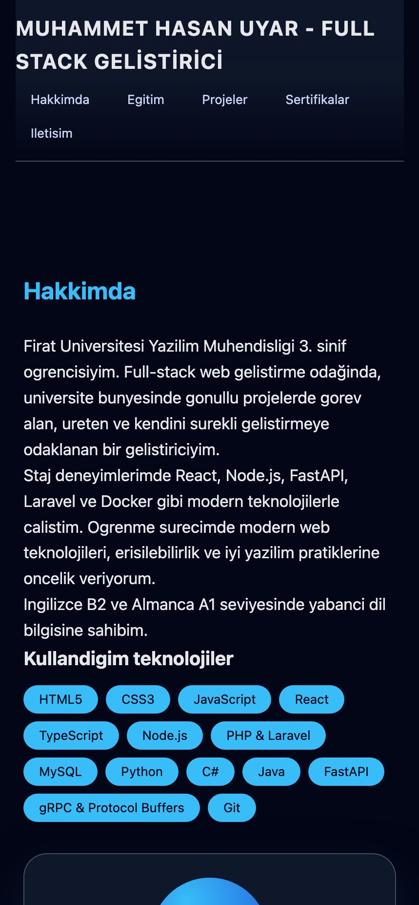
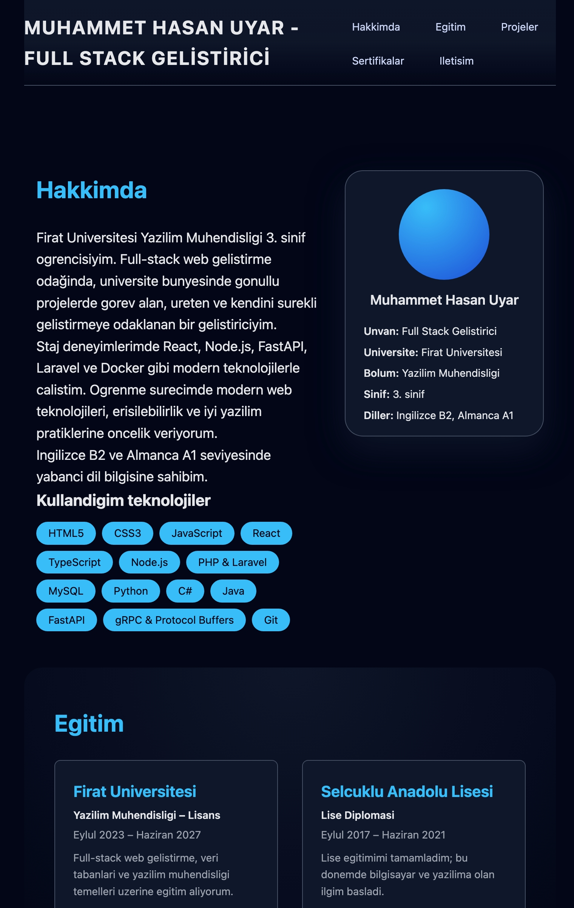
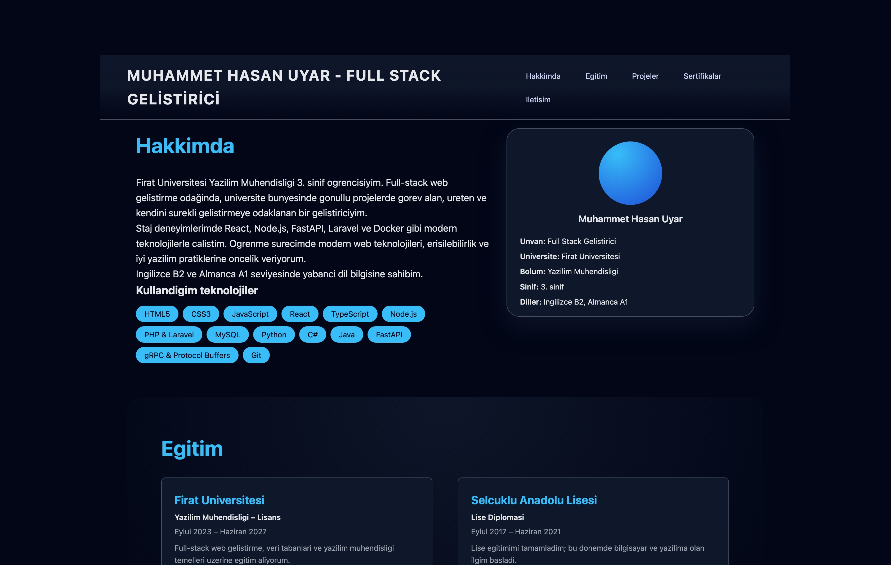

# Web Tasarimi ve Programlama – LAB-1 & LAB-2 Portfolyo Uygulamasi

## Proje Hakkinda

Bu repo, Web Tasarimi ve Programlama dersi **LAB-1** ve **LAB-2** calismalarini
tek bir modern web uygulamasi uzerinde birlestirir.

- LAB-1 kapsaminda: Vite ile React + TypeScript projesi olusturulmus,
  proje yapisi incelenmis ve Git/GitHub is akisi uygulanmistir.
- LAB-2 kapsaminda: Semantik HTML5, erisilebilirlik (a11y) ve form
  temelleri kullanilarak kisisel portfolyo sayfasi gelistirilmistir.

Uygulama, tek sayfalik bir **kisisel portfolyo** deneyimi sunar:
Hakkimda, Projelerim ve Iletisim bolumleri ile gelistiriciyi tanitir.

## Ozellikler

- **Semantik HTML yapi**: `header`, `nav`, `main`, `section`, `article`, `footer`
  etiketleri ile duzenli sayfa iskeleti
- **Hakkimda bolumu**:
  - Gelistirici hakkinda ozet bilgi
  - Kullanilan teknolojiler listesi
  - Profil karti (universite, bolum, sinif, yabanci diller)
- **Projelerim bolumu**:
  - Gercek is/staj deneyimlerinden turetilmis en az iki proje karti
  - Her proje icin aciklama ve kullanilan teknolojiler
- **Iletisim bolumu**:
  - Dogrulama ozelliklerine sahip iletisim formu
  - Telefon, e-posta, LinkedIn ve GitHub baglantilari
- **Erisilebilirlik (a11y)**:
  - Semantik heading hiyerarsisi (`h1` → `h2` → `h3`)
  - Tüm form alanlari icin `<label>` iliskisi ve `aria-describedby`
  - Alt metin icin altyapi (profil/ekran goruntuleri icin `figure` + `figcaption`)
  - Klavye ile gezinme ve belirgin focus gostergesi
  - “Ana icerige atla” (skip link) baglantisi

## Kullanilan Teknolojiler

- React 18
- TypeScript
- Vite
- Modern CSS (grid/flex, responsive tasarim)

## Proje Yapisi

- `src/App.tsx` – Kisisel portfolyo uygulamasinin ana bileşeni.
  - Header + navigasyon
  - `Hakkimda`, `Projelerim`, `Iletisim` bolumleri
- `src/App.css` – Sayfanin tum stil ve erisilebilirlik kurallari.
- `src/main.tsx` – React uygulamasinin giris noktasi.
- `index.html` – Uygulamanin temel HTML dosyasi (`lang=\"tr\"`, sayfa basligi).

## Kurulum ve Calistirma

Projeyi yerel ortaminda calistirmak icin:

```bash
cd web-lab-hello
npm install
npm run dev
```

Ardindan tarayicida `http://localhost:5173` adresini ac.

## Ekran Goruntuleri

Portfolyo sayfasi mobil, tablet ve masaustu gorunumlerinde responsive calismaktadir.

**Mobil (375px):**


**Tablet (768px):**


**Masaustu (1280px):**


## Erisilebilirlik (a11y)

Bu proje, LAB-2’de vurgulanan temel erisilebilirlik ilkelerini uygular:

- Semantik HTML5 etiketleri
- Dogru heading hiyerarsisi
- Form alanlari icin `label` ve `aria-describedby` iliskileri
- `skip-link` ile ana icerige hizli gecis
- Klavye ile tam gezinme ve belirgin `:focus-visible` cizgisi
- Karanlik arka plan uzerinde okunabilir kontrast degerleri

Chrome DevTools uzerinden Lighthouse ile **Accessibility** raporu olusturulup
90+ puan hedeflenmistir. Rapor ekran goruntusunu isterseniz
ayri bir `docs/` veya `assets/` klasorunde saklayip buradan referans verebilirsiniz.

## Git Is Akisi

Repo, profesyonel Git is akisina uygun olarak branch’ler ve anlamli commit
mesajlariyla yonetilmistir:

- `main` – Calisan, stabil ana kod.
- `feature/personalize-ui` – LAB-1 kapsaminda ilk kisilestirme ve stil degisiklikleri.
- `feature/semantic-portfolio` – LAB-2 kapsaminda semantik portfolyo, form ve a11y
  gelistirmeleri.

Ornek commit mesajlari:

- `chore: initial project setup with Vite + React + TS`
- `feat: add personal details to homepage`
- `style: update page styling and layout`
- `feat: add semantic HTML portfolio structure`
- `feat: add accessible contact form`
- `style: add base CSS and skip link`
- `fix: improve a11y based on Lighthouse report`

## Gelistirici

- **Ad Soyad:** Muhammet Hasan Uyar  
- **Unvan:** Full Stack Gelistirici  
- **Universite:** Firat Universitesi – Yazilim Muhendisligi (3. sinif)  
- **Lise:** Selcuklu Anadolu Lisesi  
- **Yabanci Diller:** Ingilizce B2, Almanca A1  

Kisa ozet: Full-stack web gelistirme odağinda, universite bunyesinde gonullu projeler
ve staj deneyimleriyle ureten, modern web teknolojileri ve erisilebilirlik konularina
agirlik veren bir gelistiriciyim.

### Iletisim

- Telefon: `+90 (553) 310 3655`
- E-posta: `m.hasanuyar@hotmail.com`
- LinkedIn: `https://www.linkedin.com/in/muhammethasanuyar/`
- GitHub: `https://github.com/Muhammethasanuyar`
